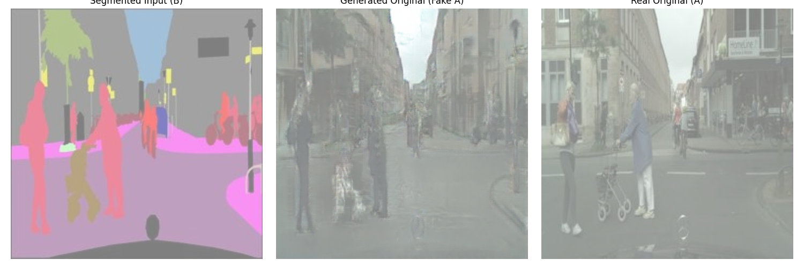

# Pix2Pix - Image Generation from Segmentation

Pix2Pix is a conditional Generative Adversarial Network (cGAN) designed for image-to-image translation tasks. In this project, Pix2Pix is applied to generate realistic images from segmentation maps. The model learns a mapping between the input segmentation map and the output image in a supervised manner, enabling realistic reconstructions based on the input structure.

## Explanation

The Pix2Pix model consists of two primary components:

1. **Generator**: Converts segmentation maps into realistic images by learning the mapping during training.
2. **Discriminator**: Evaluates the quality of the generated images by distinguishing them from real images, helping the generator improve its outputs over time.

This setup allows the model to refine its ability to generate realistic images by leveraging the adversarial loss provided by the discriminator.

### Workflow

1. **Input**: A segmentation map is fed into the generator.
2. **Output**: The generator produces an image that resembles the real target image corresponding to the segmentation map.
3. **Discriminator**: The discriminator evaluates the generator's output against real images to provide feedback.

### Example

Below is an example of the results:

